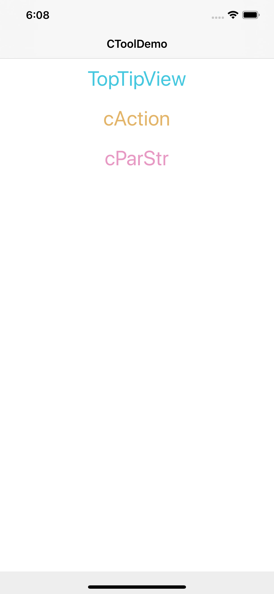
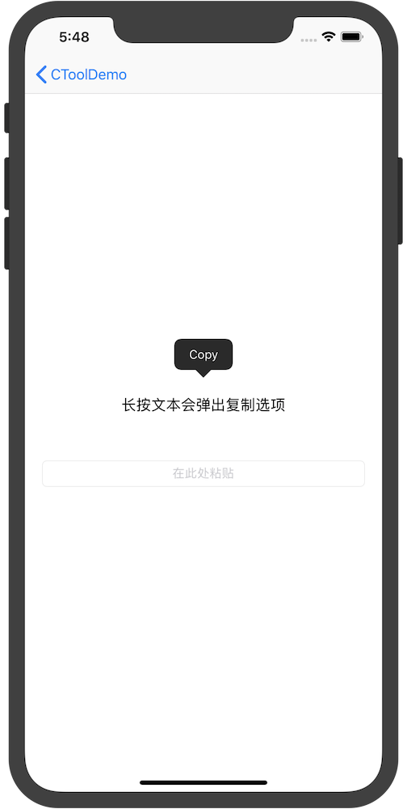

# CTool

CocoaPods  

Add pod 'CTool' to your Podfile.  
Run pod install or pod update.  
Import "CTool.h"  

  
  
    

    

1.0.7

UIButton+CButton：按钮的快速点击响应  
UILabel+CLabel：文本标签的快速点击响应  
UIImageView+CImageView：图片视图的快速点击响应  
UITextField+CTextField：输入框的回车响应  
TopTipView：类似于远程通知在屏幕顶部的提示样式  
1、文本多行可滑动查看  
2、单行支持向上清扫即可关闭  
3、可自定义：背景颜色、文本颜色、文本字体、弹出/收起动画时长、显示时长、左右边距  

1.0.8  
1、解决图片资源不能下载的问题  
      CTool.podspec 里面添加源文件路径 s.resources = 'CTool/CToolImages.bundle'

1.0.9
1、新增CToast提示
2、新增字符串小数位控制

1.1.0
1、添加了按钮快速设置标题颜色
2、添加CCopyLabel，可实现长按Label拷贝  

1.1.1
1、增加了打印对象方法，可实现打印网络请求返回的对象，直接输出中文  
2、增加了字符串、按钮的快速设置  
3、添加了UIView+CXibExt，使得xib中支持直接设置视图的描边、阴影等

